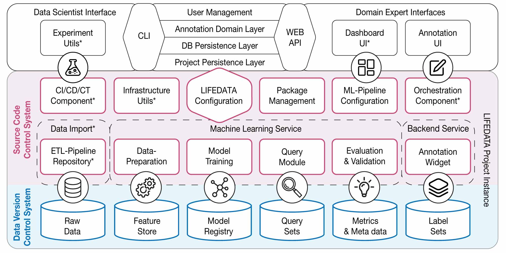

# LIFEDATA Project Template

This is a [Cookiecutter](https://github.com/cookiecutter/cookiecutter) template for a project with the LIFEDATA Framework.



## Usage

We recommend using this template using LIFEDATA's core framework. 

The setup steps to get started can be found in this [repository](https://github.com/ds-lab/lifedata).

Runnning `lifedata init <your lifedata project name>` will create a project following this template. It provides the basis for all important components as in the figure of your own Lifedata project. Components marked with * must be added additional.

### Use from repository

This template requires Python, Conda and git to be installed.  
Cookiecutter itself can be installed via

```bash
$ conda install -c conda-forge cookiecutter
```

To create a new project then run  

```bash
$ cookiecutter https://github.com/ds-lab/lifedata-cookiecutter
```

and fill your desired values. This will create the project instance as a subfolder, named by your project name.

### Local usage

Git clone this repository and follow the description below

```bash
conda env create

conda activate lifedata-cookiecutter

cookiecutter --no-input -f . -o <project instance path> project_name=<projectname>
```

and fill your desired values.

## Setup

For setup details consider the README file of the project you created.
